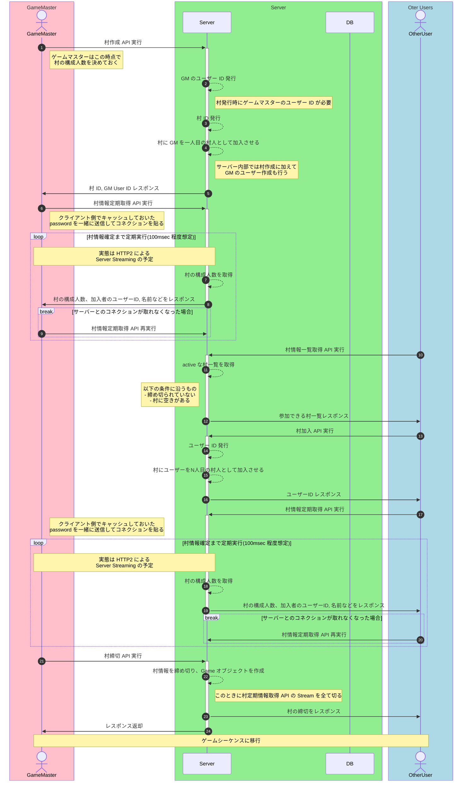

# シーケンス図: 村作成

```mermaid
%%{init: {'sequence': {'showSequenceNumbers': true}}}%%

sequenceDiagram
box Pink GameMaster
    actor gm as GameMaster
end
box LightGreen Server
    participant server as Server
    participant db as DB
end
box LightBlue Oter Users
    actor ouser as OtherUser
end

gm ->>+ server :村作成 API 実行
Note right of gm: ゲームマスターはこの時点で<br>村の構成人数を決めておく
server -->> server: GM のユーザー ID 発行
Note right of server: 村発行時にゲームマスターのユーザー ID が必要
server -->> server: 村 ID 発行
server -->> server: 村に GM を一人目の村人として加入させる
Note right of server: サーバー内部では村作成に加えて <br> GM のユーザー作成も行う
server ->>- gm: 村 ID, GM User ID レスポンス

gm ->>+ server: 村情報定期取得 API 実行
Note right of gm: クライアント側でキャッシュしておいた <br> password を一緒に送信してコネクションを貼る
loop 村情報確定まで定期実行(100msec 程度想定)
    Note over gm, server: 実態は HTTP2 による<br>Server Streaming の予定
    server -->> server: 村の構成人数を取得
    server ->>- gm: 村の構成人数、加入者のユーザーID, 名前などをレスポンス
    break サーバーとのコネクションが取れなくなった場合
        gm ->> server: 村情報定期取得 API 再実行
    end
end

ouser ->>+ server: 村情報一覧取得 API 実行
server -->> server: active な村一覧を取得
Note left of server: 以下の条件に沿うもの<br>- 締め切られていない<br>- 村に空きがある
server ->>- ouser: 参加できる村一覧レスポンス

ouser ->>+ server: 村加入 API 実行
server -->> server: ユーザー ID 発行
server -->> server: 村にユーザーをN人目の村人として加入させる
server ->>- ouser: ユーザーID レスポンス

ouser ->>+ server: 村情報定期取得 API 実行
Note right of gm: クライアント側でキャッシュしておいた <br> password を一緒に送信してコネクションを貼る
loop 村情報確定まで定期実行(100msec 程度想定)
    Note over gm, server: 実態は HTTP2 による<br>Server Streaming の予定
    server -->> server: 村の構成人数を取得
    server ->>- ouser: 村の構成人数、加入者のユーザーID, 名前などをレスポンス
    break サーバーとのコネクションが取れなくなった場合
        ouser ->> server: 村情報定期取得 API 再実行
    end
end

gm ->>+ server: 村締切 API 実行
server -->> server: 村情報を締め切り、Game オブジェクトを作成
Note right of server: このときに村定期情報取得 API の Stream を全て切る
server ->> ouser: 村の締切をレスポンス
server ->>- gm: レスポンス返却

Note over gm, ouser: ゲームシーケンスに移行
```
