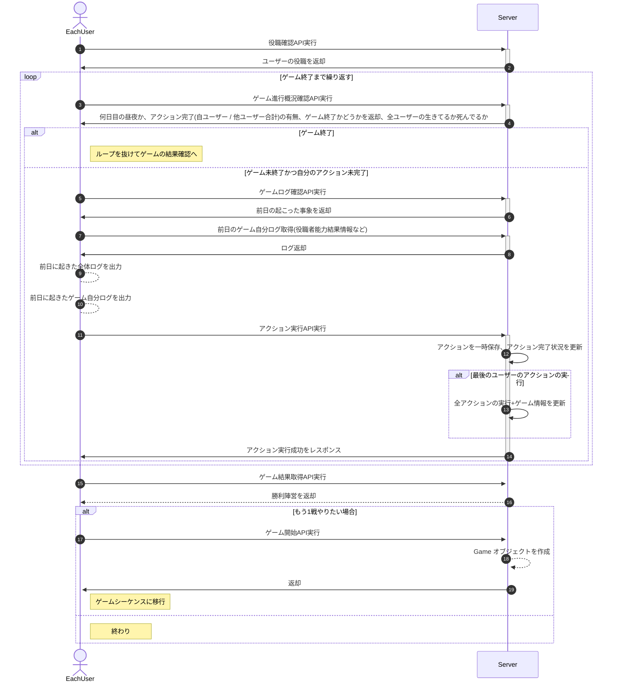

# シーケンス図: ゲームシーケンス

```mermaid
%%{init: {'sequence': {'showSequenceNumbers': true}}}%%

sequenceDiagram
actor user as EachUser
participant server as Server

user ->>+ server :役職確認API実行
server ->>- user: ユーザーの役職を返却

loop ゲーム終了まで繰り返す
    user ->>+ server :ゲーム進行概況確認API実行
    server ->>- user: 何日目の昼夜か、アクション完了(自ユーザー / 他ユーザー合計)の有無、ゲーム終了かどうかを返却、全ユーザーの生きてるか死んでるか

    alt ゲーム終了
        Note right of user: ループを抜けてゲームの結果確認へ
    else ゲーム未終了かつ自分のアクション未完了
        user ->>+ server :ゲームログ確認API実行
        server ->>- user: 前日の起こった事象を返却

        user ->>+ server: 前日のゲーム自分ログ取得(役職者能力結果情報など)
        server ->>- user: ログ返却

        user --> user: 前日に起きた全体ログを出力
        user --> user: 前日に起きたゲーム自分ログを出力

        user ->>+ server: アクション実行API実行
        server ->> server: アクションを一時保存、アクション完了状況を更新
        alt 最後のユーザーのアクションの実行
            server ->> server: 全アクションの実行+ゲーム情報を更新
        end
        server ->>- user: アクション実行成功をレスポンス
    end
end

user ->>+ server: ゲーム結果取得API実行
server -->> user: 勝利陣営を返却

alt もう1戦やりたい場合
    user ->>+ server: ゲーム開始API実行
    server -->> server: Game オブジェクトを作成
    server ->>+ user: 返却
    Note right of user: ゲームシーケンスに移行
else
    Note right of user: 終わり
end
```
